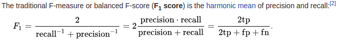
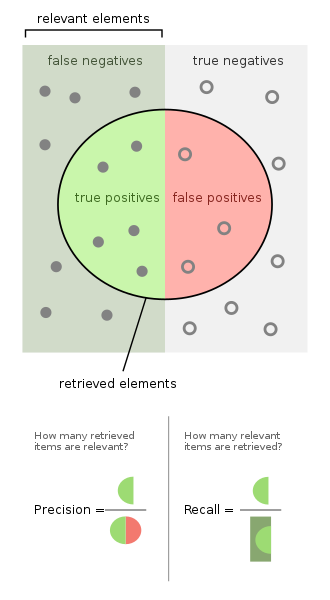

# Business Understanding

<!--- --->

## Challenge description

<!--- Look at the challenge description, understand the goal of the challenge
and write it here with your own words. Use images if they improve the explanation--->

> The data science challenge will consist in creating an image classification model, which from a given dataset, predicts what type of deforestation appears in the image with the objective of early detection of this type of actions in protected lands.

<!--- --->

> few thousand training and testing images

<!--- --->

> The challenge will be to create an image classification model and train it with the training images we provide, once you find the model that maximizes the f1-score, you will have to apply your model to classify the testing images. Your score will depend on the F1-score of your model with the test images, the quality of your code and the explanation of the solution you provide.

## Evaluation

<!--- Understand the metric used on the challenge, write it here and study
the characteristics of the metric --->

> Your score will depend on:
>
> - the F1-score of your model with the test images
> - the quality of your code
> - the quality of the explanation of the solution you provide.

So we have to train a precise model, but at the same time we have to make clean code and nice documentation.

> The winning teams will be determined by a combination of hard skills and soft skills correction.  
> The hard skills will be the responsibility of NUWE and the soft skills will be the responsibility of
Schneider Electric.

It is unclear how Schneider will judge this soft skills. On the challenge there are some times to
interact with the Schneider team so maybe they will use that information. However this mention to the
soft skills is only done in the rules, not in the website of the challenge.

### F1-score

[F-score on Wikipedia](https://en.wikipedia.org/wiki/F-score)

The F1 score gives the same weight to precision and recall. This implies that we should use a balanced
dataset when training to be able to maximize F1 score. For example if the train dataset has too many
positive classes the model will tend to focus on recall at the cost is precision because the cost of
misclassifying a positive class is bigger than misclassifying a a negative class.

#### F1-score implementations

- [sklearn](https://scikit-learn.org/stable/modules/generated/sklearn.metrics.f1_score.html)
- [keras](https://www.tensorflow.org/addons/api_docs/python/tfa/metrics/F1Score)

## Assess situation

<!---This task involves more detailed fact-finding about all of the resources,
constraints, assumptions, and other factors that should be considered in determining
the data analysis goal and project plan

* timeline. Is there any week where I could not work on the challenge?
* resources. Is there any other project competing for resources?
* other projects. May I have other more interesting projects in the horizon?
 --->

### Terminology

<!--- Sometimes the field of the challenge has specific terms, if that is the
case write them here, otherwise delete this section.--->

## Project Plan

<!--- Write initial ideas for the project. This is just initial thoughts,
during the challenge I will have a better understanding of the project and
with better information I could decide other actions not considered here.--->
