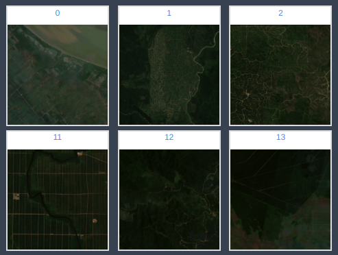
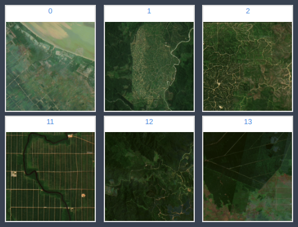

# Data Understanding

## Collect initial data

<!---Acquire the data (or access to the data) listed in the project resources.
This initial collection includes data loading, if necessary for data understanding.
For example, if you use a specific tool for data understanding, it makes perfect
sense to load your data into this tool. This effort possibly leads to initial data
preparation steps.
List the dataset(s) acquired, together with their locations, the methods used to
acquire them, and any problems encountered. Record problems encountered and any
resolutions achieved. This will aid with future replication of this project or
with the execution of similar future projects.

>	Indeed it's a pain downloading huge files. Especially when there are connection issues. I used "wget" to download the dataset with an option "-c" for resuming capability in case the download fails.  You would need to save the cookies in the page using a chrome extension Chrome Extension  save the cookies as cookies.txt from the extension  Then you can download the files by using the following command

	wget -c -x --load-cookies cookies.txt https://www.kaggle.com/c/dstl-satellite-imagery-feature-detection/data?train_wkt.csv.zip

--->

Downloading the data was very easy because it is a small dataset.

## External data

<!--- It is allowed in this challenge? If so write it here ideas of how to find
it and if people have already posted it on the forum describe it. --->

I'm not going to use External data for this challenge.

## Describe data

<!---Describe the data that has been acquired, including the format of the data,
the quantity of data (for example, the number of records and fields in each table),
the identities of the fields, and any other surface features which have been
discovered. Evaluate whether the data acquired satisfies the relevant requirements. --->

> For this challenge, you will have 2 CSVs: Train and Test. As their names indicate, the first one will be used to train your classification model on the forest images and test to know to which label they belong. It is important to remember to be careful with the paths for reading images in the train_test_data folder.

<!---  --->

> There are 3 categories:
> 
> - **Plantation**:Encoded with number 0, Network of rectangular plantation blocks, connected by a well-defined road grid. In hilly areas the layout of the plantation may follow topographic features. In this group you can find: Oil Palm Plantation, Timber Plantation and Other large-scale plantations.
> - **Grassland/Shrubland**: Encoded with number 1, Large homogeneous areas with few or sparse shrubs or trees, and which are generally persistent. Distinguished by the absence of signs of agriculture, such as clearly defined field boundaries.
> - **Smallholder Agriculture**: Encoded with number 2, Small scale area, in which you can find deforestation covered by agriculture, mixed plantation or oil palm plantation.

## Explore data

<!---This task addresses data mining questions using querying, visualization,
and reporting techniques. These include distribution of key attributes (for example,
the target attribute of a prediction task) relationships between pairs or small
numbers of attributes, results of simple aggregations, properties of significant
sub-populations, and simple statistical analyses.

Some techniques:
* Features and their importance
* Clustering
* Train/test data distribution
* Intuitions about the data
--->

- We have 1714 images for train-val and 635 test images. This is a very small dataset.
- They provide coordinates and year for the pictures. However that information in theory should not be relevant since we have the images. All the information to classify the deforestation categories should be available in the images
- There are 3 categories and they are not balanced. So it is possible that balancing them during the training will result on a better validation F1 score.
- All images are squared and have the same shape 332x332x3. They are saved in `png` format.

## Verify data quality

<!---Examine the quality of the data, addressing questions such as: Is the data
complete (does it cover all the cases required)? Is it correct, or does it contain
errors and, if there are errors, how common are they? Are there missing values in
the data? If so, how are they represented, where do they occur, and how common are they? --->

The images are very dark, maybe a preprocessing step to increase the contrast could be useful.
I have studied the distribution of the pixel values and found that we could multiply the images by 2 to increase the contrast.

The following plot shows a few original images.

Now the same images after increasing the contrast with a factor of 2 are shown.

## Amount of data

<!---
How big is the train dataset? How compared to the test set?
Is enough for DL?
--->

The dataset is very tiny for the Deep Learning standards. The best option is to fine-tune a model
that was pretrained on a bigger dataset.
