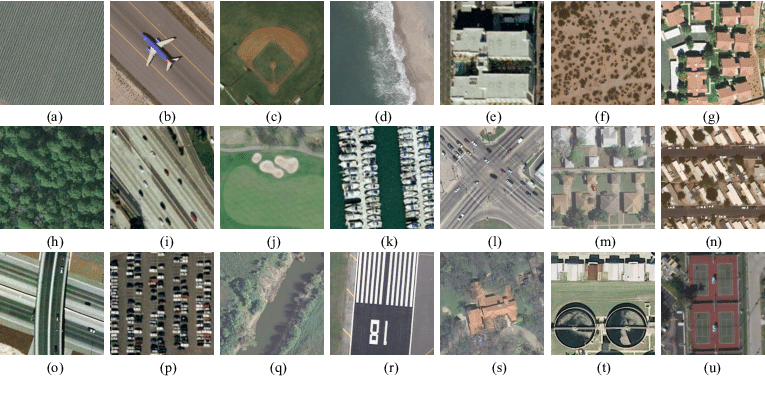

# Iteration 1. Practice with UC Merced Land Use Dataset

<!---
The work is done using short iterations. Each iteration needs to have a very
clear goal. This allows to gain greater knowledge of the problem on each iteration.
--->

## 1.1 Goal

The goal of this Iteration is to practice with the different pretrained models on UC Merced which is
similar in size to the challenge dataset.

## 1.2 Development

### 1.2.1 UC Merced Land Use Dataset

This dataset has 2100 satellite images from 21 categories (each category has 100 images) with a size of 256x256.
The compressed dataset weights around 300MB so it is very similar to the high level description of
the challenge dataset that has been given prior to the date of the challenge.



### 1.2.2 Keras pretrained models

I will start with Keras that should be the easier implementation.

#### 1.2.2.1 Install tensorflow with pip

[https://www.tensorflow.org/install/pip](https://www.tensorflow.org/install/pip)

```bash
conda install -c conda-forge cudatoolkit=11.2 cudnn=8.1.0
export LD_LIBRARY_PATH=$LD_LIBRARY_PATH$LD_LIBRARY_PATH:$CONDA_PREFIX/lib/
pip install tensorflow
python -c "import tensorflow as tf; print(tf.config.list_physical_devices('GPU'))"
```

I had to delete and create the environment from zero because tensorflow is not ready
for python 3.11.

#### 1.2.2.2 Install other dependencies

```bash
pip install opencv-python
```

## 1.3 Results

## 1.4 Next steps
